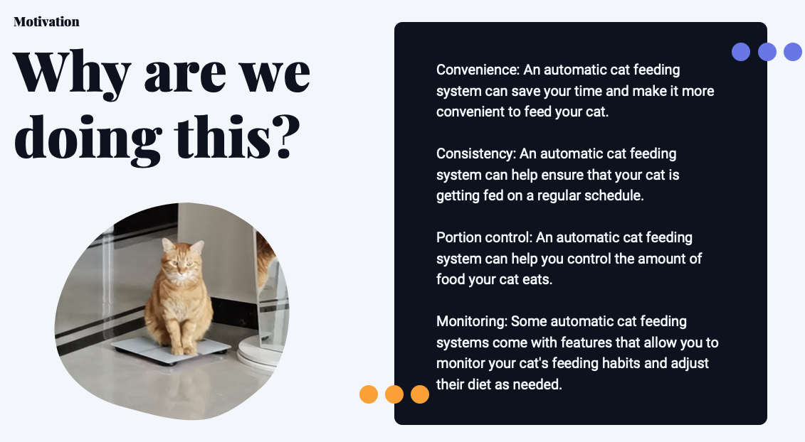
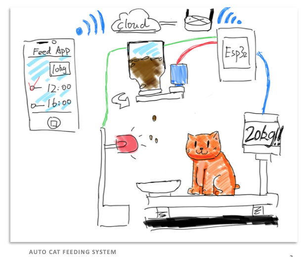
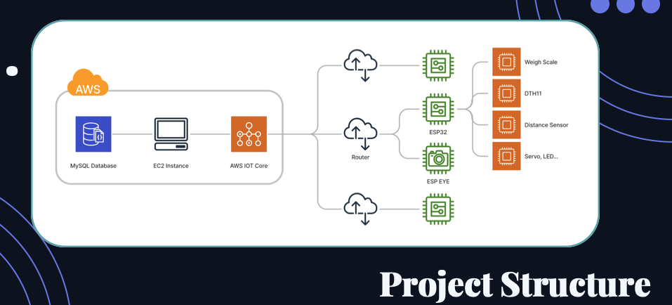
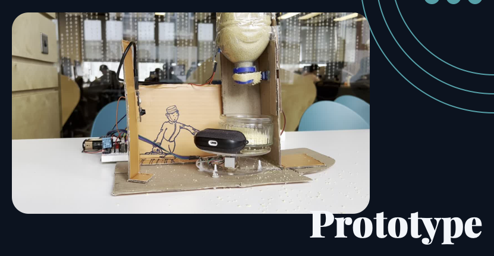

# hellokitty

This is the client application of [The Auto Cat Feeding System](https://github.com/Pookii/hello-kitty) for TCD CS7NS2-Internet of Things Course. Write with `Flutter`.

## Motivation

## System Architechture

## Product prototypes

